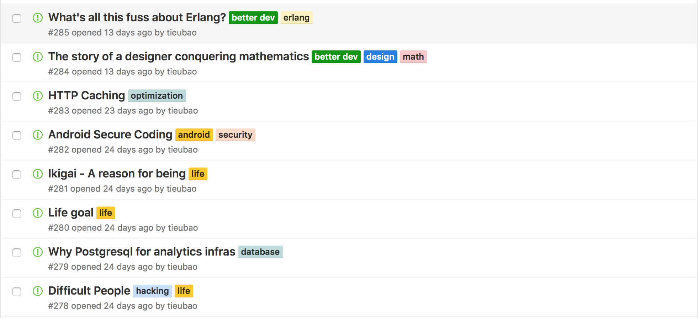

# Today I Learned - The knowledge hub

Dwarves never stop learning, and this is the space for our team members research/discuss about hard things. Hard things are? Just not easy things. We believe continous learning and getting out of comfort zone are the way to be the best individual.

These are what we've learned everyday, organized by Github Issue. If you are interested in this repo, please follow #til and support us.

- New TIL: https://github.com/dwarvesf/til/issues/new
- Dashboard: https://github.com/dwarvesf/til/issues

# License

Copyright @ Dwarves Foundation