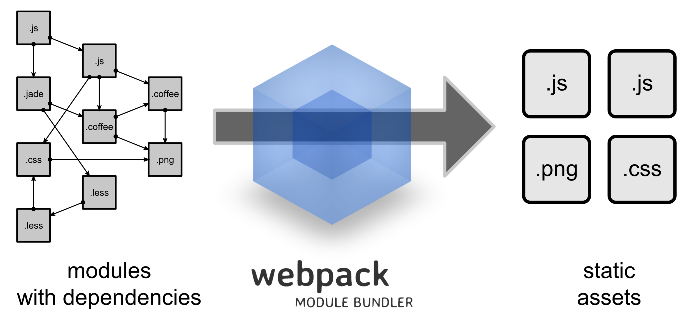

# Intro to Webpack
## And why we need it

---

1. Problems of web development
2. The savior
3. Q&A

---

# Problems of (traditional) web development

---

# No module system

```html
<html>
<head>
  <script src="jquery.js"></script>
  <script src="my-large-script-that-depends-on-jquery.js"></script>
  <script src="my-other-script-that-depends-on-above-script.js"></script>
</head>
<body>
  ...
</body>
</html>
```

---

Accessing library instance via the global namespace

```javascript
var button = $("#my-button")
var stripe = Stripe(STRIPE_TOKEN)

// What if we accidentally modified the namespaces?

$ = undefined
var button = $("#my-button") // TypeError: $ is not a function
```

---

ES6 module system with `import/export` syntax aims to solve above problems.

```javascript
import $ from 'jquery'

var button = $("#my-button")
```

But ES6 have yet to be widely adopted by all browsers.

---

# Browser compatibility

---


---


---

Even if browsers support them, there are still problems

```js
-moz-border-radius: 10px;
-webkit-border-radius: 10px;
-o-border-radius: 10px;
border-radius: 10px;
```

---

Included libraries requires addition HTTP calls

HTTP calls are slow and costly

```html
<!-- total 4 HTTP calls for each resources -->
<script src="jquery.js"></script>
<script src="bootstrap.js"></script>
<script src="bootstrap.css"></script>
<script src="app.js"></script>
```

---

And more...

---

# The Savior
## behind a simple idea

Traverse files and apply transforms with the help of loaders/plugins.

---



---

Combine modules to one single bundle + code minifying

```html
<!-- before -->
<link rel="stylesheet" href="bootstrap.css">
<link rel="stylesheet" href="ngon.css">
<link rel="stylesheet" href="duyenduyen.css">
<link rel="stylesheet" href="ntd.css">
<script src="jquery.js"></script>
<script src="bootstrap.js"></script>
<script src="app.js"></script>

<!-- after - combined & minified -->
<link rel="stylesheet" href="bundle.css">
<script src="bundle.js"></script>
```

---

Transpile ES6 codes to ES5 so all browsers can understand
(with `babel-loader`)

```js
// ES6
const foo = "bar"
const getFoo = () => foo
```

```js
// transpiled ES5
var foo = "bar";
var getFoo = function getFoo() {
  return foo;
};
```

---

Auto prefixing CSS selectors with vendor prefixes
(with `postcss-loader`)

```js
/* before */
border-radius: 10px;
```

```js
/* after */
-moz-border-radius: 10px;
-webkit-border-radius: 10px;
-o-border-radius: 10px;
border-radius: 10px;
```

---

- Dev server to watch & auto reload on files change
- Hot module reload (apply update without refreshing web paging)
- CSS modules via `postcss`
- Code splitting on demand
- Image optimization

---

# Resources

- https://webpack.github.io/
- https://github.com/dexteryy/spellbook-of-modern-webdev#toolchain

---

# Q&A
